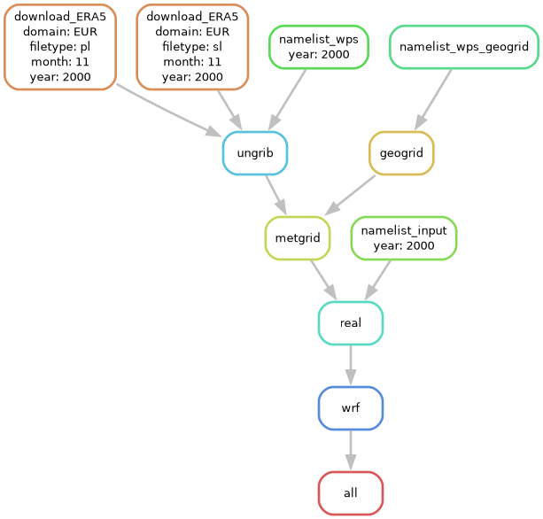

# Snakemake WRF Workflow

This repository contains a Snakemake workflow to run a WPS/WRF simulation.

The main workflow is defined in `Snakefile`. It reads `config/config.yaml`, where
the run years, ERA5 domain, input/output directories, WPS/WRF installation paths,
template namelists, and table names are configured. The Snakefile uses those
values to build the WPS and WRF steps: namelist generation, geogrid, ERA5
download, ungrib, metgrid, real, and wrf.

## Configuration

Edit `config/config.yaml` before running the workflow. The most important values
are:

- `runs`: years to simulate.
- `grib_basedir`: directory where ERA5 GRIB files are stored.
- `run_dir`: per-year WRF run directory template.
- `wps_install_dir` and `wrf_install_dir`: WPS and WRF installation directories.
- `geog_data_path`: WPS geographical data directory.
- `era5_domain`: ERA5 domain name.
- `geo_em_path`: directory for geogrid outputs.
- `namelist_wps` and `namelist_input`: Jinja2 namelist templates.

## Examples

There are two example configurations in the repository. The current `Snakefile`
is intended to be used with the `toy_example` templates in
`config/templates/toy_example/`. This example runs a light WRF simulation over
only a few days.

The ERA5 helper `ERA5/retrieve_era5_days4_6.py` was created for the toy example
to reduce the workflow runtime by downloading only the required days.

## Running Locally

Start the Pixi environment and run Snakemake:

```bash
pixi shell
snakemake
```

For a dry run:

```bash
pixi shell
snakemake -n
```

## Running on Altamira with Slurm

Load the WPS/WRF environment, enter the Pixi shell, and run Snakemake with the
Slurm profile:

```bash
source /gpfs/users/fernandezv/repos/snakemake-wrf-workflow/config/source_files/wps_josipa.sh
pixi shell
ldd `which real.exe` | grep netcdf
snakemake --profile=config/profiles/template_slurm/
```

Before running Snakemake, verify that the WRF environment is properly configured.
The `ldd` command above should show the NetCDF libraries used by `real.exe`, for
example:

```text
libnetcdff.so.7 => /gpfs/projects/meteo/opt/spack/opt/spack/linux-almalinux9-zen2/intel-2021.10.0/netcdf-fortran-4.6.1-qkxq3x6syfzslfo24e5wzcgllfrpisum/lib/libnetcdff.so.7
libnetcdf.so.19 => /gpfs/projects/meteo/opt/spack/opt/spack/linux-almalinux9-zen2/intel-2021.10.0/netcdf-c-4.9.2-r7sfzbgpbqtqpxlk5l5swrdxoej7mh4c/lib/libnetcdf.so.19
```

The Slurm profile lives in `config/profiles/template_slurm/`.

## DAG

The workflow DAG is shown below. The repository also includes the PDF version in
`dag.pdf`.



Regenerate it with:

```bash
snakemake --dag | dot -Tpdf > dag.pdf
snakemake --dag | dot -Tpng > dag.png
```

## TODO

- Decide how to protect the workflow from missing control files due to storage
  problems such as partition unmounts.
- Create a Snakefile to run CORDEX in Altamira. The main difference is that the
  domain is provided as an argument.
- Decide which symbolic links are created by default and which are provided by
  the user. For example, `GEOGRID.TBL` and `METGRID.TBL` are provided by the
  user, but `Vtable` is created by default. The user can provide a custom
  `Vtable` if desired.
- Download `geog_data_path` from
  https://www2.mmm.ucar.edu/wrf/site/access_code/geog_data.html if it is not
  available.
- Improve `ERA5/retrieve_era5.py` to support days as an argument. Decide how to
  handle this in the Snakefile.
- Ask Josipa if it would be possible to clean the WRF/run template folder.
  Decide how to deal with the excludes:
  `/gpfs/projects/meteo/WORK/ASNA/projects/cordex-core/02_SAM12_evaluation/rundir/WRFv4.6.1-cordex_core/run/`.
